<div align="center">

# 🛡️ DockGate

### A security & policy gateway that keeps AI agents off the raw Docker socket.

[](https://github.com/amdadulbari/Dockgate/actions/workflows/ci.yml)
[](https://hub.docker.com/r/amdadulbari/dockgate)
[](https://hub.docker.com/r/amdadulbari/dockgate/tags)
[](go.mod)
[](LICENSE)
[](https://github.com/amdadulbari/Dockgate/stargazers)

<br/>



</div>

---

## Why

Giving an AI agent the Docker socket (`/var/run/docker.sock`) is giving it **root on the host**:

```bash
# With the raw socket, this is all it takes to own the machine:
docker run -v /:/host --privileged alpine chroot /host sh
```

**DockGate** puts a policy check in the middle. The agent talks to DockGate, never to the socket. Every operation is validated against a tiny YAML policy — and audited — before DockGate forwards approved requests to the real Docker Engine.

Because DockGate speaks the **native Docker Engine API**, every Docker client works unchanged — the `docker` CLI, the Python/Go SDKs, or raw HTTP. You only change the endpoint.

- ✅ **Default deny** — nothing is allowed unless a rule says so
- 🔒 **Create guardrails** — block privileged mode, host networking, bind mounts, capabilities, and untrusted images
- 📋 **Full audit trail** — every allow/deny logged as JSON
- 🚪 **Fail closed** — malformed or unknown requests are denied, not forwarded
- 🪶 **Tiny & fast** — a single static Go binary, one dependency

## Quick start

Pull the image, give it the socket + a policy, and point your client at it:

```bash
docker run -d --name dockgate \
  -p 127.0.0.1:2375:2375 \
  -v /var/run/docker.sock:/var/run/docker.sock \
  -v "$PWD/policy.yaml:/etc/dockgate/policy.yaml:ro" \
  --group-add "$(getent group docker | cut -d: -f3)" \
  amdadulbari/dockgate:latest
```

```bash
export DOCKER_HOST=tcp://127.0.0.1:2375

docker ps                       # ✅ allowed
docker run --rm nginx           # ✅ allowed (nginx is on the allow-list)
docker run --privileged nginx   # ⛔ denied: privileged containers are not permitted
docker run --rm ubuntu          # ⛔ denied: ubuntu is not in allowed_images
docker network create test      # ⛔ denied by default
```

> **Building from source?** `make run` builds `./bin/dockgate` and listens on `127.0.0.1:2375`.

## The policy is one small YAML file

Deny everything, then allow only what your agent needs. This is a complete, **read-only** policy — the agent can look, but never touch:

```yaml
default_action: deny

rules:
  - name: "Read-only"
    effect: allow
    actions:
      - system.ping
      - container.list
      - container.inspect
      - container.logs
      - image.list
```

`docker ps`, `docker logs`, and `docker inspect` succeed; `docker run`, `docker stop`, `docker rm`, and everything else return `403`.

<details>
<summary><b>📖 Full policy reference</b> — rules, matching, and container-create guardrails</summary>

<br/>

A policy is a default action plus an ordered list of rules. **The first rule whose `actions` match the request decides the outcome**; if none match, `default_action` applies.

```yaml
default_action: deny         # deny | allow  (what to do when no rule matches)

rules:
  - name: "Restart existing containers"
    effect: allow             # allow | deny  (default: allow)
    actions: [container.start, container.stop, container.restart]

  - name: "Create hardened containers from approved images"
    effect: allow
    actions: [container.create]
    allowed_images:           # only these image patterns may be created
      - "nginx"               #   bare name → any tag of nginx
      - "redis:*"             #   glob      → any tag of redis
      - "ghcr.io/acme/*"      #   any image from your registry org
    deny_privileged: true     # reject --privileged
    deny_host_network: true   # reject --network host
    deny_host_pid: true       # reject --pid host
    deny_host_ipc: true       # reject --ipc host
    deny_bind_mounts: true    # reject -v /host/path:...
    denied_capabilities: [ALL]# reject any --cap-add

  - name: "Never allow exec into containers"
    effect: deny
    actions: [container.exec, exec.start]
```

**Action patterns** — each `actions` entry is an exact action (`container.create`), a category wildcard (`container.*`), or `*` (everything).

**Allow + constraints** — if a matching `allow` rule has constraints (the fields below), the request must satisfy **all** of them, or it is denied and the log records exactly which one failed. Constraints apply to `container.create`:

| Field | Effect |
|-------|--------|
| `allowed_images` | Glob allow-list. A bare name (`nginx`) matches any tag/digest; `redis:*` requires a tag; `ghcr.io/acme/*` matches an org. |
| `deny_privileged` | Reject privileged containers. |
| `deny_host_network` / `deny_host_pid` / `deny_host_ipc` | Reject sharing the host network / PID / IPC namespace. |
| `deny_bind_mounts` | Reject host-path bind mounts (named volumes still allowed). |
| `denied_capabilities` | Forbid `--cap-add` of the listed capabilities (e.g. `SYS_ADMIN`, or `ALL`). |

Ready-made policies live in [`examples/policies/`](examples/policies/): [`read-only.yaml`](examples/policies/read-only.yaml) and [`restart-only.yaml`](examples/policies/restart-only.yaml).

</details>

<details>
<summary><b>🧭 Action reference</b> — the canonical names you use in <code>actions:</code></summary>

<br/>

| Category | Actions |
|----------|---------|
| `system` | `system.ping`, `system.version`, `system.info`, `system.df`, `system.events`, `system.auth` |
| `container` | `container.list`, `container.create`, `container.inspect`, `container.logs`, `container.top`, `container.stats`, `container.changes`, `container.export`, `container.archive.read`, `container.archive.write`, `container.start`, `container.stop`, `container.restart`, `container.kill`, `container.pause`, `container.unpause`, `container.rename`, `container.update`, `container.resize`, `container.wait`, `container.attach`, `container.exec`, `container.remove`, `container.prune` |
| `exec` | `exec.start`, `exec.resize`, `exec.inspect` |
| `image` | `image.list`, `image.pull`, `image.inspect`, `image.history`, `image.save`, `image.load`, `image.search`, `image.tag`, `image.push`, `image.remove`, `image.build`, `image.commit`, `image.prune` |
| `network` | `network.list`, `network.inspect`, `network.create`, `network.connect`, `network.disconnect`, `network.remove`, `network.prune` |
| `volume` | `volume.list`, `volume.inspect`, `volume.create`, `volume.remove`, `volume.prune` |
| `swarm` / `service` / `secret` / `config` | `swarm.init`, `swarm.join`, `swarm.leave`, `swarm.inspect`, `service.list`, `service.create`, `secret.list`, `secret.create`, `config.list`, `config.create` |

Unlisted endpoints classify as `unknown` and hit `default_action`. `container.exec` + `exec.start` are how a client runs commands inside a container — deny them unless you have a specific reason not to.

</details>

<details>
<summary><b>⚙️ Configuration & signals</b></summary>

<br/>

Every flag has a `DOCKGATE_*` environment fallback.

| Flag | Env | Default | Description |
|------|-----|---------|-------------|
| `--listen` | `DOCKGATE_LISTEN` | `127.0.0.1:2375` | Where agents connect (`host:port` or `unix:///path`). Use `0.0.0.0:2375` in a container. |
| `--docker-socket` | `DOCKGATE_DOCKER_SOCKET` | `/var/run/docker.sock` | The real Docker Engine socket. |
| `--policy` | `DOCKGATE_POLICY` | `policy.yaml` | Path to the YAML policy. |
| `--audit-log` | `DOCKGATE_AUDIT_LOG` | `-` (stdout) | Audit destination: `-` for stdout, or a file path. |

**Signals** — `SIGHUP` reloads the policy live (a bad edit is rejected and the previous policy kept); `SIGINT` / `SIGTERM` shut down gracefully.

```bash
kill -HUP "$(pgrep dockgate)"   # apply an edited policy.yaml without dropping connections
```

</details>

<details>
<summary><b>📋 Audit log</b> — one JSON object per line</summary>

<br/>

```json
{"time":"2026-08-24T17:53:14Z","method":"GET","path":"/_ping","action":"system.ping","decision":"allow","rule":"Read-only","reason":"allowed by rule \"Read-only\""}
{"time":"2026-08-24T17:53:14Z","method":"POST","path":"/v1.43/containers/create","action":"container.create","decision":"deny","rule":"...","reason":"privileged containers are not permitted","image":"nginx","status":403}
```

```bash
tail -f audit.log | jq 'select(.decision=="deny")'   # watch only denials
```

</details>

## Security model

DockGate is an **authorization gateway**: an agent can only perform the Docker operations your policy permits, and every attempt is recorded. For that promise to hold:

- **Keep the socket off the agent.** Mount `/var/run/docker.sock` into DockGate only, and put the agent on a network where DockGate is its sole route to Docker.
- **Protect the DockGate endpoint.** Anyone who can reach it gets whatever the policy allows — bind it to loopback or a private network, and front it with auth/mTLS on untrusted networks.
- **`allow` deliberately.** `image.build`, `container.exec`, and `container.update` can be used to escalate; the shipped policy denies them by default.

Found a vulnerability? See [SECURITY.md](SECURITY.md).

## Development

```bash
make test     # unit + end-to-end tests
make race     # tests under the race detector
make build    # build ./bin/dockgate
make docker   # build the container image
```

Small and dependency-light (only `gopkg.in/yaml.v3`):

```
cmd/dockgate        entrypoint, server lifecycle, signals
internal/dockerapi  request → canonical action; container-create parsing
internal/policy     policy loading + evaluation (the security core)
internal/audit      structured JSON-lines audit logging
internal/proxy      reverse proxy to the Docker socket
internal/gateway    the HTTP handler tying it together
```

Contributions welcome — see [CONTRIBUTING.md](CONTRIBUTING.md).

---

<div align="center">

**If DockGate is useful to you, please ⭐ star the repo — it genuinely helps.**

</div>
